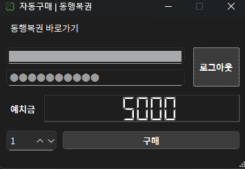

# AutoLottery

[](https://github.com/leewr9/atlottery/releases)


This is a Korean automatic lottery purchase program. Built with a PySide6-based GUI and Selenium, it enables automatic lottery ticket purchasing without the need for a separate web browser.



## Feature

- Simple GUI built with PySide6
- Automated lottery purchase using Selenium
- No external web browser required
- Supports executable build with PyInstaller

## Installation

1. **Clone the repository**

   ```bash
   git clone https://github.com/leewr9/atlottery.git
   cd atlottery
   ```

2. **Install dependencies via uv**

   ```bash
   uv sync
   ```

3. **Run the application**

   ```bash
   uv run python main.py.
   ```

## Usage

### Build Executable

You can build an executable file using PyInstaller and the provided spec file.

```bash
uv run pyinstaller ./atlottery.spec
```

- The executable will be created in the `dist` folder.
- Ensure the `atlottery.spec` file is correctly configured with resource paths and build options.

## License

This project is licensed under the **MIT License**. See the [LICENSE](LICENSE) file for details.
